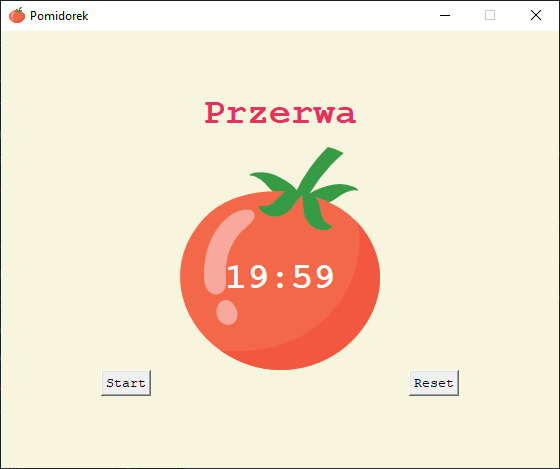

# pomidorek
<h3>
 Pomidorek is a diminutive of the word 🍅 in Polish. It is named this way because it's a small and simple Pomodoro application.  
</h3>
App was written in Python. Only two modules were used and that's because Pomidorek 🍅 is a really lightweight app that helps you with productivity. 

<h3>In order for this app to work a module called tkinter needs to be installed on your machine.</h3> You just need to use pip and your terminal. 
Type <i>pip install tk</i> and it will download on your machine.  
There are four stages of this app. 

<h4>First one is an IDLE state when the app is waiting for user's action.  
 
<h4>The second stage is triggered when user will click on the Start button.</h4>
Clock starts counting 25 minutes which is a "work time". 
 
<h4>Then there is a quick, 5 minute break.</h4>
 
<h4>The last stage is a longer break. It lasts for 20 minutes and it's an award for working 4 times which is a whole hour.</h4>
 

Then the whole cycle keeps repeating itself. 
<h4>For every completed "work" stage you get one ✔️ which you can see on the bottom of the window.</h4>
 

<h3>Button function:</h3> 
Button "Start" obviously starts the counter. 
The second one which is the "Reset" button is also self-explanatory. It does what it's name says. It resets the program so you can start learning/working again or finish using the app if you're done with your task.  
<h3>Modules used: 
</h3> 
tkinter and math

